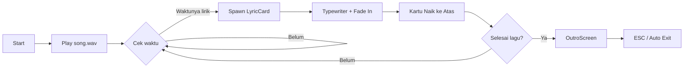

# 🎵 CodeSong V3 — Olivia Rodrigo "drop dead" Lyric Video

<div align="center">


### ✨ Floating Lyric Video Engine — Python Edition ✨

**Aesthetic lyric cards yang naik dari bawah layar, sinkron dengan lagu, ditutup dengan outro cinematic.**

[🎬 Preview](#-preview) · [⚙️ Instalasi](#-instalasi) · [🚀 Cara Run](#-cara-run) · [🧠 Cara Kerja](#-cara-kerja-kode) · [💌 Credit](#-credit--komunitas)

</div>

---

## 📸 Preview

> Kartu lirik muncul bergantian kiri–kanan dengan animasi **typewriter**, lalu mengapung naik ke atas layar.
> Setelah lagu selesai, muncul **outro cinematic** dengan judul lagu, credit, dan logo RevsCloud.

```
╔══════════════════════════════════════════════════╗
║                                                  ║
║   ✦ ─────────────────────────────── ✦            ║
║                                                  ║
║        One night I was bored in bed              ║
║                                                  ║
║           •   •   •                              ║
║                                                  ║
╚══════════════════════════════════════════════════╝
        ↑ kartu melayang dari bawah ke atas
```

---

## 🌟 Fitur

| Fitur | Deskripsi |
|---|---|
| 🎭 **Floating Lyric Cards** | Kartu lirik naik dari bawah layar dengan animasi halus |
| ⌨️ **Typewriter Effect** | Teks lirik diketik karakter per karakter |
| 🔀 **Auto Zigzag Layout** | Kartu muncul bergantian kiri-kanan |
| 🎨 **Elegant Serif Design** | Font serif klasik dengan ornamen ✦ ala *editorial* |
| 🌫️ **Dim Overlay** | Background diredupkan otomatis biar lirik standout |
| 🎬 **Cinematic Outro** | Outro dengan animasi scale-bounce judul & logo |
| 🖼️ **Logo Support** | Bisa pakai `logo.png` (butuh PIL) atau fallback teks |
| ⌨️ **ESC to Exit** | Tekan `ESC` kapan aja buat keluar dari program |

---

## 📦 Requirements

| Package | Versi | Status | Kegunaan |
|---|---|---|---|
| **Python** | `3.11.9` | Wajib | Runtime utama |
| **pygame** | `2.6.1` | Wajib | Memutar file lagu (`song.wav`) |
| **Pillow (PIL)** | `12.3.0` | Opsional | Load & resize `logo.png` di outro |
| **tkinter** | Built-in | Wajib | GUI & rendering kartu lirik |
| **random** | Built-in | Wajib | Random posisi kartu |
| **time** | Built-in | Wajib | Sinkronisasi waktu & animasi |

---

## ⚙️ Instalasi

### 1. Clone repo-nya

```bash
git clone https://github.com/revscloud/CSV3-Olivia-Rodrigo-drop-dead.git
cd CSV3-Olivia-Rodrigo-drop-dead
```

### 2. (Opsional) Buat virtual environment

```bash
# Windows
python -m venv venv
venv\Scripts\activate

# macOS / Linux
python3 -m venv venv
source venv/bin/activate
```

### 3. Install dependencies

**Install semua sekaligus:**

```bash
pip install pygame==2.6.1 pillow==12.3.0
```

**Atau satu per satu:**

```bash
# Wajib — buat play lagu
pip install pygame==2.6.1

# Opsional — buat support logo.png
pip install pillow==12.3.0
```

**Atau pakai `requirements.txt`:**

Buat file `requirements.txt`:

```txt
pygame==2.6.1
pillow==12.3.0
```

Lalu install dengan:

```bash
pip install -r requirements.txt
```

### 4. Cek instalasi

```bash
python -c "import pygame, PIL; print('pygame', pygame.version.ver); print('Pillow', PIL.__version__)"
```

Output yang diharapkan:

```
pygame 2.6.1
Pillow 12.3.0
```

> 💡 `tkinter` biasanya udah bawaan Python.
> Kalau di Linux belum ada: `sudo apt install python3-tk`
> Kalau di macOS pakai Homebrew: `brew install python-tk`

---

## 🚀 Cara Run

### 1. Siapkan file lagu

Letakkan file lagu dengan nama **`song.wav`** di folder yang sama dengan script.

> 💡 **Format `.wav` lebih disarankan** biar load-nya cepat dan nggak ada delay.
> Kalau file kamu `.mp3`, convert dulu pake [Audacity](https://www.audacityteam.org/) atau `ffmpeg`:
> ```bash
> ffmpeg -i song.mp3 song.wav
> ```

### 2. (Opsional) Siapkan logo

Taruh **`logo.png`** di folder yang sama. Kalau nggak ada, program otomatis pakai teks **"RevsCloud"** sebagai fallback.

### 3. Jalankan

```bash
python main.py
```

### 4. Keluar

Tekan **`ESC`** kapan saja untuk keluar. Program akan fade-out dengan mulus sebelum benar-benar ditutup.

---

## 📁 Struktur Folder

```
/
├── main.py               # Script utama
├── song.wav              # File lagu (WAJIB ada)
├── logo.png              # Logo outro (opsional)
├── requirements.txt      # Daftar dependencies
└── README.md             # Dokumentasi ini
```

---

## ✂️ Cara Setting Lagu & Lirik (PENTING!)

Bagian paling penting dari CodeSong adalah **sinkronisasi** antara potongan lagu dan timestamp lirik.

### 🎯 Langkah-langkah:

#### **1. Potong lagu sesuai momen yang pas**

Misalnya di lagu aslinya kamu mau mulai dari **menit 01:45**. Maka:

- ❌ **Jangan** potong pas di `01:45` — bakal kerasa mepet & aneh
- ✅ **Cut di `01:40`** atau cari **momentum yang pas** (intro, beat drop, atau bagian hening)

Tujuannya: ketika lagu di-play dari awal file cut-an, ada sedikit jeda natural sebelum lirik mulai muncul.

#### **2. Tentukan timestamp lirik**

Setelah lagu dipotong, dengerin lagu yang udah dipotong dari **detik 0**, sambil catat **detik berapa setiap baris lirik mulai terdengar**.

Contoh dari lagu *Olivia Rodrigo — drop dead*:

```python
LYRICS = [
    (8,    "One night I was bored in bed"),
    (11.5, "And stalked you on the internet"),
    (15.5, "It's feminine intuition"),
    (18.5, "'Cuz I always had a vision of us standing like this"),
    (22.5, "All pressed up in the bathroom line"),
    (26,   "You're looking like an angel on the walls of Versailles"),
    (30,   "The most alive I've ever been"),
    (34,   "But kiss me and I might"),
]
```

- Angka `8`, `11.5`, `15.5`, dst = **detik** dari awal lagu yang udah dipotong
- Kalau lirik "It's feminine intuition" mulai kedengaran di **detik 15.5** dari lagu cut-an, berarti tulis `15.5`
- Boleh pakai desimal (`.`), contoh `11.5` = 11 setengah detik

#### **3. Tips sinkronisasi:**

- 🎧 Pakai **headphone** biar lebih presisi
- ⏱️ Buka lagu di **Audacity** / **CapCut** biar bisa lihat waveform
- 🎯 Timestamp = momen **kata pertama mulai keluar dari vokal**, bukan momen kartu muncul
- 🧪 **Test dulu** beberapa kali, adjust kalau kerasa terlalu cepat/lambat

---

## 🧠 Cara Kerja Kode

### 🔄 Alur Program



### 📂 Struktur Class

#### 🎴 `LyricCard`
Kartu lirik yang muncul di layar.

| Method | Fungsi |
|---|---|
| `__init__` | Bikin window `Toplevel` transparan, tanpa border, selalu di atas |
| `typewriter()` | Animasi ngetik karakter per karakter |
| `_fade_in()` | Fade-in opacity kartu dari 0 → 0.97 |
| `rise(dy)` | Gerakkan kartu ke atas setiap frame |
| `is_offscreen()` | Cek kalau kartu udah keluar layar (buat dihapus) |

#### 🎬 `OutroScreen`
Layar penutup setelah lagu selesai.

| Method | Fungsi |
|---|---|
| `_run_intro_sequence()` | Urutan animasi: bg → title → credit → logo |
| `_animate_font_scale()` | Animasi ukuran font bounce pakai `ease_out_back` |
| `_animate_logo()` | Scale + fade-in logo secara smooth |
| `fade_out()` | Fade-out semua sebelum exit |

#### 🎼 `LyricFloatApp`
Orchestrator utama.

| Method | Fungsi |
|---|---|
| `create_overlay()` | Bikin overlay hitam transparan di background |
| `random_x_on_side()` | Random posisi horizontal (kiri/kanan) |
| `next_y()` | Hitung posisi Y biar kartu-kartu tidak numpuk |
| `tick()` | **Heartbeat** program: cek waktu → spawn → naikkan → outro |
| `exit_program()` | Fade-out → destroy semua window |

---

## 📚 Fungsi Library yang Dipakai

### 🐍 Bawaan Python

| Library | Fungsi di Project |
|---|---|
| **`tkinter`** | Bikin window, frame, label, canvas, dan render semua UI kartu lirik |
| **`tkinter.font`** | Auto-detect font serif terbaik yang tersedia di sistem (Playfair Display → Georgia → dst) |
| **`random`** | Random posisi X kartu biar nggak monoton + jitter Y |
| **`time`** | Sinkronisasi timestamp lirik, hitung delta-time buat animasi halus |

### 📦 External

| Library | Versi | Fungsi di Project |
|---|---|---|
| **`pygame`** | `2.6.1` | Load & play `song.wav` via `pygame.mixer.music` |
| **`PIL` (Pillow)** | `12.3.0` | *(Opsional)* Load & resize `logo.png` untuk outro. Kalau nggak ada, fallback ke teks |

---

## 🎨 Kustomisasi

Semua warna & ukuran bisa diubah di bagian atas file:

```python
# Warna tema kartu
BG_COLOR     = "#FAF5EA"   # background kartu (krem)
FG_COLOR     = "#2A241C"   # warna teks (coklat tua)
ACCENT_COLOR = "#B4884E"   # ornamen ✦ (emas)
BORDER_COLOR = "#DDCFAF"   # border kartu

# Ukuran & kecepatan
BOX_W, BOX_H        = 420, 290   # ukuran kartu
RISE_SPEED          = 88         # kecepatan naik (pixel/detik)
STACK_SPACING       = 44         # jarak antar kartu
OVERLAY_ALPHA       = 0.55       # kegelapan background

# Outro
OUTRO_BG     = "#14110E"   # background outro (hitam)
OUTRO_FG     = "#FAF5EA"   # warna judul
OUTRO_ACCENT = "#C79A5E"   # warna aksen outro
SONG_TITLE   = "Olivia Rodrigo — Drop Dead"
```

---

## 🐛 Troubleshooting

| Masalah | Solusi |
|---|---|
| `ModuleNotFoundError: No module named 'pygame'` | `pip install pygame==2.6.1` |
| `ModuleNotFoundError: No module named 'PIL'` | `pip install pillow==12.3.0` |
| Suara lagu nggak keluar | Pastikan file `song.wav` ada di folder yang sama |
| Muncul error `pygame.error: mixer not initialized` | Update pygame, atau restart Python |
| Kartu lirik nggak muncul | Cek `LYRICS` — timestamp harus **angka** bukan string |
| Logo nggak muncul | Install `pillow`: `pip install pillow==12.3.0` |
| `ESC` nggak keluar | Klik dulu ke window yang aktif, baru tekan `ESC` |
| Error `pip: command not found` | Coba `pip3` atau `python -m pip install ...` |

### 🔄 Command Install Cepat (Copy-Paste)

```bash
# Semua sekaligus
pip install pygame==2.6.1 pillow==12.3.0

# Cek versi
python -c "import pygame, PIL; print('pygame', pygame.version.ver); print('Pillow', PIL.__version__)"

# Kalau pip error, coba upgrade dulu
python -m pip install --upgrade pip
python -m pip install pygame==2.6.1 pillow==12.3.0
```

### 🗑️ Uninstall (kalau perlu)

```bash
pip uninstall pygame pillow
```

---

## 💌 Credit & Komunitas

<div align="center">

### ⚠️ WAJIB BACA ⚠️

Kalau kamu **pakai code ini** untuk bikin konten (TikTok, YouTube, Reels, dll),
**tolong credit ke RevsCloud** ya! 🙏

</div>

### 📌 Format Credit yang Diharapkan

Tulis di caption / deskripsi / overlay video:

```
Lyric video by RevsCloud
TikTok/IG: @revs.cloud
```

atau tag langsung akun di bawah ini:

<div align="center">

| Platform | Akun |
|---|---|
| 🎵 **TikTok** | [@nopee_ken](https://www.tiktok.com/@nopee_ken) · [@revs.cloud](https://www.tiktok.com/@revs.cloud) |
| 📸 **Instagram** | [@alwaysskenn](https://instagram.com/alwaysskenn) · [@revs.cloud](https://instagram.com/revs.cloud) |

</div>

### 💬 Join Komunitas

Punya pertanyaan? Mau sharing hasil karya? Atau butuh bantuan?

<div align="center">

### 👉 [**RevsCloud Discussion — WhatsApp Group**](https://chat.whatsapp.com/Ef4Fhe93D5Z9hDPakqRSQO) 👈

[](https://chat.whatsapp.com/Ef4Fhe93D5Z9hDPakqRSQO)

</div>

---

## 📜 License

**Free to use** untuk keperluan konten pribadi & komersial, **dengan syarat tetap mencantumkan credit** ke **RevsCloud**.

Dilarang:
- ❌ Menjual ulang script ini sebagai produk
- ❌ Mengklaim sebagai karya sendiri tanpa credit

---

<div align="center">

### Made with ❤️ by **RevsCloud**

*"Setiap detik lirik punya momennya sendiri."*

⭐ Kalau project ini membantu, jangan lupa kasih **star** di repo ini!


</div>
